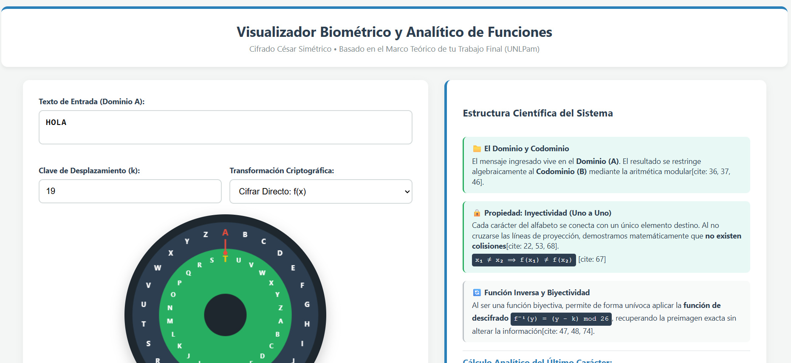

# JavaScript & HTML5 Canvas: Visualizador Analítico de Funciones y Cifrado César Modular

Este repositorio contiene un simulador criptográfico y matemático interactivo desarrollado en **JavaScript nativo (Vanilla JS)** y **HTML5 Canvas**. El sistema funciona como un laboratorio visual diseñado para modelar el comportamiento algebraico del Cifrado César Simétrico, representando los caracteres alfabéticos como un espacio vectorial discreto. La aplicación mapea las proyecciones en tiempo real mediante discos concéntricos dinámicos, demostrando de forma empírica y didáctica propiedades de las funciones inyectivas, biyectivas y cálculo analítico de preimágenes por aritmética modular.

---

## 📊 Interfaz y Renderizado Gráfico del Sistema

Para que la rueda criptográfica de dos ejes de colores se previsualice directamente al ingresar a tu repositorio, guarda una captura de pantalla de la web en la raíz con el nombre exacto de `previsualizacion.png`:



---

## ⚙️ Análisis de la Arquitectura Matemática del Software

El código fuente en `index.html` destaca por desacoplar la lógica de cálculo algebraico de las rutinas de renderizado gráfico por vectores:

### 1. Transformación Lineal y Aritmética Modular Restringida
El motor evalúa las posiciones del alfabeto en base 26 ($0 \dots 25$). Para mitigar los desbordamientos de rango por traslación de índices o desplazamientos negativos durante el descifrado, la aplicación implementa una normalización de base modular complementaria de forma matemática:
```javascript
// Cálculo del desplazamiento efectivo para evitar índices negativos fuera de rango (Underflow)
let despEfectivo = modo === 'encriptar' ? k : (n - (k % n)) % n;

// Aplicación de la función de congruencia modular
let nuevaPos = (x + despEfectivo) % n;

```

### 2. Trazado Analítico y Logs de Trazabilidad Dinámica

A medida que el operador tipea caracteres en el **Dominio (A)**, el sistema aísla atómicamente el último token ingresado y desglosa su ecuación formal en pantalla para validar la preimagen exacta en el **Codominio (B)**:

* **Función de Cifrado Directo:** 
$$f(x) = (x + k) \pmod{26}$$


* **Función Inversa Analítica:** 
$$f^{-1}(y) = (y - k) \pmod{26}$$


### 3. Renderizado Vectorial de Discos Concéntricos (`HTML5 Canvas`)

El entorno gráfico dibuja de forma asíncrona mediante trigonometría cartesiana las posiciones angulares de cada letra basándose en fracciones radiales del círculo ($\theta = \frac{i \cdot 2\pi}{n} - \frac{\pi}{2}$). Al detectar la coincidencia del token modificado, altera las propiedades de los pinceles (`fillStyle`) para iluminar y trazar el vector de proyección dinámico (flecha de mapeo) que une ambos alfabetos sin colisiones.

---

## 🛠️ Conceptos Científicos Demostrados

* **Propiedad de Inyectividad (Uno a Uno)**: Demostración visual de que para cada elemento del Dominio le corresponde una imagen única en el Codominio ($x_1 \neq x_2 \implies f(x_1) \neq f(x_2)$), garantizando que las líneas de proyección nunca se crucen y eliminando colisiones de datos.
* **Biyectividad y Reversibilidad**: Validación estructural que asegura la existencia de una función inversa ($f^{-1}$), permitiendo recuperar el mensaje original sin pérdida de bits ni alteración de la información estructural de la preimagen.
* **Manejo Sincrónico del DOM**: Uso de escuchas reactivas (`addEventListener`) vinculadas a los eventos de entrada de la interfaz gráfica para recalcular las matrices de píxeles del Canvas de forma instantánea ante cualquier mutación de variables.


¡Es una joya de proyecto, Cielo! Subilo organizado, sacale la captura de pantalla al Canvas y actualizá tu menú indexador. Con esto demostrás versatilidad total en Python, Tableau, Pascal y ahora JavaScript aplicado a la ciencia. ¡A romperla! 🚀💥🔐🌐
